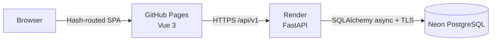

# Auranoise

> Quietly record what happened, reflect on it, and see how life moves forward.

Auranoise is a private, single-user daily review application. It combines structured Markdown reflections, immutable completion snapshots, goals and tasks, search, timelines, basic streak statistics, Trash, and portable backups. It is intentionally not a todo app, social product, or Notion clone.

## Architecture



The backend follows `Router → Service → Repository → SQLAlchemy → PostgreSQL`. Every user-owned resource carries or inherits a `user_id` ownership check. PostgreSQL constraints protect unique daily reviews, valid statuses, foreign keys, and settings ranges. Production schema changes are applied only through Alembic.

## Tech Stack

- Frontend: Vue 3, TypeScript, Vite, Vue Router (hash history), Pinia, Axios, Tailwind CSS, markdown-it, DOMPurify, dayjs
- Backend: Python 3.12+, FastAPI, Pydantic v2, SQLAlchemy 2 async, asyncpg, Alembic, PyJWT, Argon2
- Tests: pytest/httpx with an isolated SQLite database; Vitest/jsdom for frontend logic
- Deployment: GitHub Pages, Render, Neon PostgreSQL

## Project Structure

```text
auranoise/
├── .github/workflows/deploy-pages.yml
├── backend/
│   ├── alembic/                 # versioned database migrations
│   ├── app/
│   │   ├── api/v1/              # REST routers
│   │   ├── core/                # config, auth security, errors
│   │   ├── db/                  # async session and declarative base
│   │   ├── models/              # SQLAlchemy models
│   │   ├── repositories/        # database access
│   │   ├── schemas/             # Pydantic request/response models
│   │   └── services/            # business rules
│   └── tests/
├── frontend/src/
│   ├── api/                     # configured Axios client
│   ├── components/
│   ├── layouts/
│   ├── router/
│   ├── stores/                  # auth, reviews, goals, settings
│   ├── types/
│   ├── utils/
│   └── views/
├── docker-compose.yml
└── render.yaml
```

## Local Development

Prerequisites: Python 3.12+, Node.js 22+, npm, and Docker.

```bash
git clone <repository-url> auranoise
cd auranoise

cp .env.example .env
cp backend/.env.example backend/.env
cp frontend/.env.example frontend/.env

docker compose up -d db

python3 -m venv .venv
source .venv/bin/activate
pip install -e 'backend[dev]'

cd backend
alembic upgrade head
uvicorn app.main:app --reload
```

In a second terminal:

```bash
cd frontend
npm ci
npm run dev
```

Open `http://localhost:5173`. On the first backend start after migration, the account from `INITIAL_USERNAME` and `INITIAL_PASSWORD` is created. Change that password in Settings.

If port 5432 is already occupied, set `POSTGRES_PORT=55432` in the root `.env` and update the port in `backend/.env`.

## Environment Variables

Backend (`backend/.env`):

| Variable | Purpose |
|---|---|
| `APP_ENV` | `development` or `production` |
| `DATABASE_URL` | PostgreSQL URL; plain `postgresql://` Neon URLs are normalized for asyncpg |
| `JWT_SECRET` | Unique random secret, at least 32 characters in production |
| `JWT_ALGORITHM` | Defaults to `HS256` |
| `JWT_EXPIRE_MINUTES` | Access-token lifetime |
| `INITIAL_USERNAME` | Bootstrap username, used only when no user exists |
| `INITIAL_PASSWORD` | Bootstrap password; never stored in plaintext |
| `FRONTEND_ORIGINS` | Comma-separated exact origins, such as `http://localhost:5173,https://name.github.io` |

Frontend (`frontend/.env`):

| Variable | Purpose |
|---|---|
| `VITE_API_BASE_URL` | API root, e.g. `http://localhost:8000/api/v1` |
| `VITE_BASE_PATH` | Vite asset base, `/` locally or `/repository-name/` on Pages |

Never commit `.env`, credentials, passwords, or JWT secrets.

## Database Migration

```bash
cd backend
alembic upgrade head
alembic current
alembic check
```

Create a migration after changing models:

```bash
alembic revision --autogenerate -m "describe the change"
```

Review generated migrations before applying them. The application does not call `Base.metadata.create_all()` in production.

## Testing

```bash
cd backend
../.venv/bin/pytest -q

cd ../frontend
npm test
npm run typecheck
npm run build
```

The backend test database is independent of development PostgreSQL. Coverage focuses on authentication, ownership, review constraints, autosave updates, snapshots, goals/tasks, links/events, search, streaks/timezones, soft deletion, and backup validation.

## API

Interactive documentation remains available at `/docs`; the OpenAPI document is at `/openapi.json`. Health checks use `GET /health`. All application endpoints are below `/api/v1`.

Login example:

```bash
curl -X POST http://localhost:8000/api/v1/auth/login \
  -H 'Content-Type: application/json' \
  -d '{"username":"admin","password":"your-password"}'
```

Authenticated example:

```bash
curl http://localhost:8000/api/v1/reviews/today \
  -H "Authorization: Bearer $TOKEN"
```

Errors use `{ "code", "message", "details" }`. List endpoints use bounded `page` and `page_size` parameters.

## GitHub Pages Deployment

1. In the GitHub repository, enable Pages with **GitHub Actions** as the source.
2. Add the repository variable `VITE_API_BASE_URL`, for example `https://auranoise-api.onrender.com/api/v1`.
3. Push to `main`. The workflow tests, builds with `VITE_BASE_PATH=/<repository>/`, and deploys `frontend/dist`.
4. Add the resulting exact Pages origin (for example `https://name.github.io`) to backend `FRONTEND_ORIGINS`.

The SPA uses `createWebHashHistory()`, so page refreshes do not require a Pages rewrite rule.

## Render Deployment

The included `render.yaml` defines one Python web service. Connect the repository in Render, then set:

- `DATABASE_URL` to the Neon connection string
- `INITIAL_USERNAME` and a strong `INITIAL_PASSWORD`
- `FRONTEND_ORIGINS` to the exact GitHub Pages origin

Render generates `JWT_SECRET`. The start command runs `alembic upgrade head` before Uvicorn and uses `/health` for health checks. No VPS or background worker is required.

## Neon Setup

1. Create a Neon project and database.
2. Copy its pooled PostgreSQL connection string into Render `DATABASE_URL`.
3. Keep TLS enabled in the Neon URL.
4. Deploy Render; Alembic creates and upgrades the schema.

Use one production database and a separate database or branch for migration rehearsal. Do not run tests against production.

## Backup / Restore

Settings → Backup provides:

- JSON: versioned, machine-restorable data without password hashes, tokens, or secrets
- Markdown ZIP: readable `reviews/YYYY/MM/` and `goals/` files
- Full ZIP: `backup.json` plus Markdown files under `auranoise-backup/`

JSON import validates `schema_version`, displays a preview, requires explicit confirmation, and runs in one transaction. A serious validation or constraint error rolls back the import. UUIDs prevent duplicate records.

## Security and Data Safety

- Argon2 password hashes and expiring JWT access tokens
- Exact-origin CORS; wildcard origins are rejected in production
- Backend ownership checks for every important resource
- Pydantic input validation and database constraints
- DOMPurify after Markdown rendering; raw HTML is disabled
- Soft deletion with configurable 7/30/90-day or never retention
- Completion snapshots are immutable; ordinary autosave never creates snapshots
- Structured request metadata logs omit JWTs, passwords, and diary content

## Known V1 Limitations

- One bootstrapped account and no public registration or account-management UI
- Access tokens live in browser local storage; there are no refresh tokens
- Local draft recovery is best-effort, not offline synchronization
- Search uses PostgreSQL `ILIKE`, not full-text or semantic search
- Trash cleanup is lazy when Trash is opened; there is no scheduled worker
- No images, attachments, sharing, notifications, PWA, mobile app, or manual goal logs
- AI endpoints are placeholders and return `501`; no LLM SDK is installed

## Future Roadmap

Only add these when a concrete need exists: multi-user administration, refresh-token/session management, scheduled retention cleanup, PostgreSQL full-text search at larger scale, and optional weekly/monthly reflection summaries behind explicit AI configuration.

Quietly record what happened, reflect on it, and see how life moves forward.
